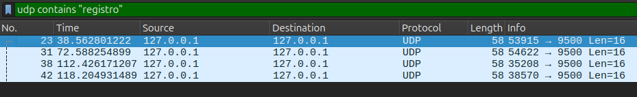

## ATIVIDADE 1 - CHAT UDP SIMPLES

* O servidor e vários clientes em diferentes terminais foram iniciados.  
* O envio e recebimento de mensagens foi testado:

  

* Utilizando o Wireshark para analisar o tráfego UDP e observar o comportamento:

  **Quando um novo cliente se registra:**  
  * Um pacote é enviado Cliente --> Servidor.  
  Ex: 53915 (porta cliente) --> 9500 (porta servidor).  
  A imagem mostra o registro de 4 clientes.  
  `/registro: nome_usuario`
  * Depois, outro pacote é enviado Servidor --> Cliente.  
  `nome_usuario entrou no chat`
  * Broadcast para todos clientes.
  
    

  **Quando um cliente envia mensagem:**
  * Um pacote é enviado Cliente --> Servidor.  
  `nome: mensagem`
  * Um pacote é enviado Servidor --> Todos  
   `nome: mensagem` (broadcast)
   Enviado para múltiplos IPs : portas
  * Cada mensagem gera 1 pacote do cliente + N pacotes do servidor (para N clientes)  

  *Exemplo: filtrando todas as mensagens enviadas pelo cliente "teste4" (porta 53915)* 

    

  **Quando um cliente sai do chat:**  

  * Um pacote é enviado Cliente --> Servidor.  
  `/sair`
  * Um pacote é enviado Servidor --> Todos  
   `teste4 saiu do chat` (broadcast)

## ATIVIDADE 2 - SISTEMA DE TRANSFERÊNCIA DE ARQUIVOS

* Servidor iniciado no terminal:  
    

* Foram preparados 3 arquivos de diferentes tamanhos:  
  * `arquivo-teste-pequeno`: um arquivo de texto (118 bytes)
  * `arquivo-teste-medio`: uma imagem (1,8 MB)
  * `arquivo-teste-grande`: um arquivo pdf (11,1 MB)  

* Tempo e taxa de transferência  para cada um dos arquivos:  
      
      
      

## ATIVIDADE 3 - ANÁLISE COMPARATIVA UDP VS TCP 

  ### Cenário 1: Rede Local sem Perda

  * (Por falta de acesso a outro computador os servidores e clientes foram executados no mesmo).  
  * Um arquivo de 5,6 MB foi transferido.
  * Resultados:  

    **UDP**  

            
    **TCP**  

        

  * O TCP é eficiente nesse cenário já que a rede não tem perda e ele envia múltiplos pacotes antes de esperar ACKs.
  * O UDP tem maior overhead por confirmar fragmento a fragmento.    

  ### Cenário 2: Rede com Perda de Pacotes  
  * Foi simulado uma rede com perda de pacotes e as transferências UDP e TCP foram repetidas.  
  * Resultados:  
  
    **UDP**  
            
    **TCP**  
       

  * O UDP sofre mais já que é necessário reenviar e aguardar.

  ### Cenário 3: Rede com Alta Latência    
  * Foi simulado uma rede com alta latência e as transferências UDP e TCP foram repetidas.  
  
  * Resultados:  

    **UDP**  
            
    **TCP**  
       
  * O UDP é pior nesse cenário já que é necessário aguardar um ACK por fragmento.
  * O TCP compensa usando uma janela de envio que permite enviar vários pacotes antes de esperar o próximo ACK.

---

## PERGUNTAS DE REFLEXÃO  
* **Quais foram os principais desafios ao implementar aplicações com UDP?**    
    O UDP não garante que os pacotes vão chegar ao destino e nem que vão chegar em ordem, além de não haver controle de fluxo.

* **Como você contornou a falta de garantias de entrega do UDP?**  
    * Sistema de confirmação - o servidor envia confirmações para cada pacote recebido (`ack = seq_num.to_bytes(4, byteorder='big')`).

    * Controle de sequência - os dois lados mantêm controle do próximo número de sequência esperado (`esperado_seq` no servidor, `seq_num` no cliente).  

    * O cliente envia uma solicitação ("ENVIAR:") e espera uma confirmação ("PRONTO") antes de iniciar a transferência.

*  **Em quais situações você recomendaria o uso de UDP ao invés de TCP?**  
    Em situações como uma aplicação em tempo real (VoIP por exemplo), onde a latência baixa é mais importante que uma perda ocasional de pacotes;  
    e em aplicações com atualizações frequentes (como jogos online) onde as informações mais recentes são mais relevantes que as perdidas.     
* **Como o comportamento do UDP poderia impactar aplicações de tempo real?**  
    Como a latência é baixa, (ausência do handskake inicial e controle de congestionamento) o UDP é mais rápido;  
    Em sistemas como streaming, os pacotes atrasados são descartados e não há uma espera por retransmissões, então há uma priorização de dados recentes;  
    Outro impacto seria que as aplicações precisam lidar com perdas ou desordem de pacotes.
